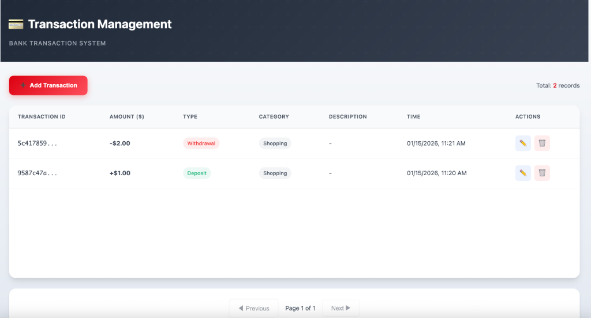

# Bank Transaction Management System

A production-ready Spring Boot application for managing banking transactions, featuring RESTful APIs, high-performance caching, web UI, and comprehensive testing.

## ✨ Highlights

| Requirement | Implementation |
|-------------|----------------|
| Java 21 + Spring Boot | ✅ Record Classes, Sealed Classes, Pattern Matching, Virtual Threads |
| In-memory Storage | ✅ ConcurrentHashMap with thread-safe operations |
| RESTful API | ✅ Full CRUD with pagination support |
| Web Interface | ✅ Responsive UI for transaction management |
| Caching | ✅ Caffeine high-performance cache |
| Validation & Exception Handling | ✅ Global exception handler with detailed error responses |
| Containerization | ✅ Docker & Docker Compose ready |
| Testing | ✅ Unit tests + Stress tests (100+ concurrent threads) |

## 🚀 Quick Start

### Option 1: Maven (Recommended)

```bash
# Run application
mvn spring-boot:run

# Access Web UI: http://localhost:8080
# Access Swagger: http://localhost:8080/swagger-ui.html
```

### Option 2: Docker

```bash
docker-compose up --build
```

## 🖥️ Web Interface

The application includes a modern, responsive web interface for managing transactions:

**Access**: http://localhost:8080




| Feature | Description |
|---------|-------------|
| **Transaction List** | Paginated table view with all transaction details |
| **Add Transaction** | Modal form to create new transactions |
| **Edit Transaction** | Modify existing transaction details |
| **Delete Transaction** | Confirmation dialog with undo protection |
| **Real-time Feedback** | Toast notifications for all operations |


## 📋 API Endpoints

**Swagger UI**: http://localhost:8080/swagger-ui.html

| Method | Endpoint | Description |
|--------|----------|-------------|
| `POST` | `/api/transactions` | Create transaction |
| `GET` | `/api/transactions/{id}` | Get transaction by ID |
| `GET` | `/api/transactions?page=0&size=10` | List transactions (paginated) |
| `PUT` | `/api/transactions/{id}` | Update transaction |
| `DELETE` | `/api/transactions/{id}` | Delete transaction |


## 🧪 Testing

```bash
# Run all tests
mvn test

# Unit tests only
mvn test -Dtest=TransactionServiceTest,TransactionControllerTest

# Stress tests only
mvn test -Dtest=TransactionStressTest
```

### Test Coverage

| Test Type | Description | Scenarios |
|-----------|-------------|-----------|
| **Unit Tests** | Service & Controller layer | CRUD operations, validation, error handling |
| **Stress Tests** | Concurrency & Performance | 100 concurrent threads, 1000+ transactions |

### Performance Metrics

| Scenario | Result |
|----------|--------|
| Concurrent creation (100 threads) | ~1000+ ops/sec |
| High-load reads | ~2000+ ops/sec |
| Batch writes (1000 records) | < 5 seconds |

## 🏗️ Architecture

```
src/main/java/com/bank/transaction/
├── controller/     # REST API endpoints + Page controller
├── service/        # Business logic with caching
├── repository/     # In-memory data storage
├── dto/            # Request/Response records (JDK 21)
├── entity/         # Transaction entity
├── exception/      # Sealed exception hierarchy (JDK 21)
└── config/         # Cache & Virtual Thread configs

src/main/resources/
├── templates/      # Thymeleaf HTML templates
├── static/css/     # Premium CSS styles
└── application.yml # Application configuration
```

## 📦 Dependencies

| Dependency | Purpose |
|------------|---------|
| `spring-boot-starter-web` | REST API support |
| `spring-boot-starter-thymeleaf` | Server-side HTML rendering |
| `spring-boot-starter-validation` | Request validation |
| `spring-boot-starter-cache` + `caffeine` | High-performance caching |
| `springdoc-openapi-starter-webmvc-ui` | Swagger documentation |
| `spring-boot-starter-test` | JUnit 5 testing |

## 📄 License

MIT License
